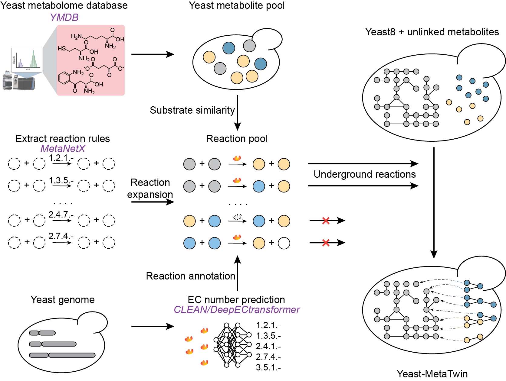

Yeast-MetaTwin
======

  

## Introduction
We designed a systematic workflow for mining underground metabolism, which combines rule-based retrosynthesis approach with deep learning-based enzyme annotation approach. Using this workflow, we constructed **Yeast-MetaTwin**, the first genome-scale metabolic model that systematically integrates underground networks, Yeast-MetaTwin encompasses 84% of the predicted metabolic enzymes and 92% of the metabolome in yeast.

## Usage
  - Download the Yeast-MetaTwin package
  
         git clone https://github.com/LiLabTsinghua/Yeast-MetaTwin.git
  
  - Create and activate enviroment
  
         conda create -n  Yeast_MT python=3.7
         conda activate Yeast_MT

  - Download required Python package
         
         conda install ipykernel
         pip install biopython
         pip install fair-esm==2.0.0
         pip install gurobipy  
         pip install matplotlib
         pip install numpy
         pip install pandas
         pip install plotly
         pip install pubchempy
         pip install rdchiral==1.1.0
         pip install rdkit-pypi==2022.9.5
         pip install rxnmapper==0.3.0
         pip install scikit-learn
         pip install seaborn
         pip install cobra        
         pip install torch==1.13.1

## Reproducible Run
This project consists of four modules, which should be executed in the following order: the **retrosynthesis** must be run first, while the **kcatkm_prediction** and **ECnumber_prediction** can be executed as needed. Within each module, we have indicated the execution order in the filenames of the Jupyter notebooks.

- **retrosynthesis:**  `./Code/retrosynthesis`  
- **ECnumber_prediction:** `./Code/ECnumber_prediction`  
- **kcatkm_prediction:** `./Code/kcatkm_prediction`  
- **analysis:** `./Code/analysis`  

The data generated from the retrosynthesis will be saved in `./Data_retrosynthesis`, and the pre-trained protein model esm-1b required for deep learning will be stored in `./esm`. Both of these resources can be found on [`Zenodo`](10.5281/zenodo.13893231).

Please note that for the different prediction methods in the EC number prediction and kcat/km prediction modules, you need to set up the environment according to their respective GitHub sources. These projects are designed for user-friendly operation.
- **ECnumber_prediction:**  
 - [`CLEAN`](https://github.com/tttianhao/CLEAN)  
 - [`DeepECtransformer`](https://github.com/kaistsystemsbiology/DeepProZyme)  
- **kcatkm_prediction:**   
 - [`DLKcat`](https://github.com/SysBioChalmers/DLKcat)  
 - [`UniKP`](https://github.com/Luo-SynBioLab/UniKP)  
 - [`TurNuP`](https://github.com/AlexanderKroll/kcat_prediction)  
 - [`Boost_KM`](https://github.com/AlexanderKroll/KM_prediction)  

## Model Availability
The Yeast-MetaTwin (non-lipids) and Yeast-MetaTwin (non-lipids and lipids) models are available in `./Data/model`.

## Citation
Please cite the prpint paper [Yeast-MetaTwin for Systematically Exploring Yeast Metabolism through Retrobiosynthesis and Deep Learning](https://doi.org/10.1101/2024.09.02.610684)

Contact
-------

-   Feiran Li ([@feiranl](https://github.com/feiranl)), Tsinghua Shenzhen International Graduate School, Tsinghua University, Shenzhen, China
-   Ke Wu ([@wuke](https://github.com/wuke0714)), Tsinghua Shenzhen International Graduate School, Tsinghua University, Shenzhen, China

Last update: 2024-10-07
